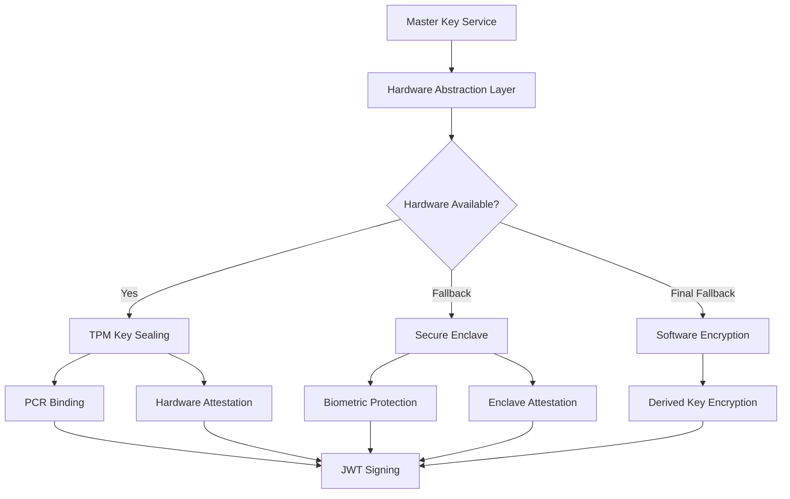

# Hardware-Backed Security Architecture

## Overview

The Universal AI Governor implements a comprehensive hardware-backed security architecture that provides military-grade protection through multiple layers of hardware security modules. This document outlines the architecture, fallback mechanisms, and integration patterns.

## Hardware Security Hierarchy

```
┌─────────────────────────────────────────────────────────────────┐
│                    APPLICATION LAYER                            │
├─────────────────────────────────────────────────────────────────┤
│  Master Key Service │ JWT Signing │ Audit Logger │ Attestation  │
├─────────────────────────────────────────────────────────────────┤
│                 HARDWARE ABSTRACTION LAYER                      │
├─────────────────────────────────────────────────────────────────┤
│  Priority 1: TPM 2.0  │  Priority 2: Secure Enclave  │ Priority 3: Software │
│  ┌─────────────────┐  │  ┌─────────────────────────┐  │  ┌─────────────────┐ │
│  │ • PCR Sealing   │  │  │ • Apple Secure Enclave │  │  │ • Encrypted     │ │
│  │ • Hardware RNG  │  │  │ • Intel SGX            │  │  │   Storage       │ │
│  │ • Attestation   │  │  │ • ARM TrustZone        │  │  │ • Software      │ │
│  │ • Quote/Verify  │  │  │ • Biometric Protection │  │  │   Crypto        │ │
│  └─────────────────┘  │  └─────────────────────────┘  │  └─────────────────┘ │
└─────────────────────────────────────────────────────────────────┘
```

## Component Architecture

### 1. Hardware Abstraction Layer (HAL)

The HAL provides a unified interface to all hardware security modules:

```rust
pub struct HardwareAbstraction {
    tpm_interface: Option<TmpInterface>,
    hsm_interface: Option<HsmInterface>,
    secure_storage: RwLock<HashMap<String, SecureValue>>,
    config: HardwareConfig,
}
```

**Key Features:**
- Unified API across all hardware types
- Automatic fallback hierarchy
- PCR-based tamper detection
- Hardware-backed random generation
- Cryptographic operations within secure boundaries

### 2. TPM 2.0 Integration

**Primary Security Functions:**
- **Key Sealing**: Master keys sealed to Platform Configuration Registers (PCRs)
- **Attestation**: TPM quotes for remote verification
- **Measured Boot**: Boot integrity measurements in PCRs 0-7
- **Hardware RNG**: True random number generation

**PCR Usage:**
```
PCR 0: UEFI Firmware and Boot Loader
PCR 1: Host Platform Configuration
PCR 2: UEFI Driver and ROM Code
PCR 3: UEFI Driver and ROM Code Configuration
PCR 7: Secure Boot Policy
```

### 3. Secure Enclave Support

**Apple Secure Enclave (macOS/iOS):**
- Non-extractable key storage
- Biometric authentication integration
- Hardware-backed cryptographic operations
- Device attestation capabilities

**Intel SGX (Linux/Windows):**
- Isolated execution environment
- Remote attestation with Intel Attestation Service
- Encrypted memory protection
- Side-channel attack resistance

### 4. Master Key Service Integration



## Security Features

### 1. Tamper Detection

**PCR Monitoring:**
- Continuous PCR value verification
- Boot integrity validation
- Runtime measurement verification
- Automatic key access denial on tampering

**System State Monitoring:**
- Memory integrity checks
- File system integrity validation
- Process list monitoring
- Network state verification

### 2. Audit Trail Integration

**Enhanced Audit Entries:**
```rust
pub struct EnhancedAuditEntry {
    pub base_entry: BaseAuditEntry,
    pub hardware_attestation: HardwareAttestation,
    pub integrity_proof: IntegrityProof,
    pub tamper_evidence: TamperEvidence,
    pub cryptographic_binding: CryptographicBinding,
}
```

**Blockchain-Style Integrity:**
- Merkle tree construction
- Proof-of-work mining
- Tamper-evident audit chains
- Multi-party verification

### 3. Remote Attestation

**Attestation Flow:**
1. Client requests attestation with nonce
2. TPM generates quote with PCR values
3. Hardware signs attestation data
4. Client verifies certificate chain
5. Trust level assessment

**Verification Components:**
- TPM quote signature validation
- PCR value comparison
- Firmware hash verification
- Certificate chain validation
- Timestamp verification

## Fallback Mechanisms

### 1. Hardware Selection Priority

```rust
async fn select_best_enclave(&self, preferred: Option<EnclaveType>) -> Result<EnclaveType, EnclaveError> {
    // 1. Check for preferred enclave type
    if let Some(preferred_type) = preferred {
        if self.is_enclave_available(&preferred_type) {
            return Ok(preferred_type);
        }
    }
    
    // 2. Fallback hierarchy
    if self.tpm_interface.is_some() {
        Ok(EnclaveType::TmpSealed)
    } else if self.apple_enclave.as_ref().map_or(false, |e| e.available) {
        Ok(EnclaveType::AppleSecureEnclave)
    } else if self.intel_sgx.as_ref().map_or(false, |e| e.available) {
        Ok(EnclaveType::IntelSgx)
    } else if self.config.fallback_to_software {
        Ok(EnclaveType::SoftwareFallback)
    } else {
        Err(EnclaveError::NoEnclaveAvailable)
    }
}
```

### 2. Graceful Degradation

**Security Level Maintenance:**
- Hardware operations preferred
- Secure enclave as secondary option
- Software fallback with encryption
- Clear security level indication

**Performance Optimization:**
- Hardware operation caching
- Batch processing for efficiency
- Asynchronous operations
- Connection pooling for HSMs

## Deployment Configurations

### 1. Enterprise Server Configuration

```yaml
hardware_config:
  tpm_enabled: true
  hsm_enabled: true
  secure_enclave_enabled: false
  pcr_binding_enabled: true
  attestation_required: true
  
master_key_config:
  require_hardware_backing: true
  key_rotation_interval_hours: 168  # Weekly
  pcr_binding_enabled: true
  
audit_config:
  pcr_snapshot_enabled: true
  hsm_attestation_enabled: true
  blockchain_integrity: true
  tamper_detection_sensitivity: "High"
```

### 2. Workstation Configuration

```yaml
hardware_config:
  tmp_enabled: true
  hsm_enabled: false
  secure_enclave_enabled: true  # macOS only
  pcr_binding_enabled: true
  fallback_to_software: true
  
master_key_config:
  require_hardware_backing: false
  key_rotation_interval_hours: 24
  
audit_config:
  pcr_snapshot_enabled: true
  blockchain_integrity: false
  tamper_detection_sensitivity: "Medium"
```

### 3. Cloud/Container Configuration

```yaml
hardware_config:
  tpm_enabled: false  # vTPM if available
  hsm_enabled: false
  secure_enclave_enabled: false
  fallback_to_software: true
  
master_key_config:
  require_hardware_backing: false
  key_rotation_interval_hours: 12
  
audit_config:
  pcr_snapshot_enabled: false
  blockchain_integrity: true
  tamper_detection_sensitivity: "Low"
```

## Security Considerations

### 1. Threat Model

**Protected Against:**
- Key extraction attacks
- Boot-time tampering
- Runtime system modification
- Audit log tampering
- Replay attacks
- Side-channel attacks (with SGX)

**Assumptions:**
- Hardware security modules are trusted
- Physical access is controlled
- Firmware is authentic and measured
- Network communications are secured

### 2. Key Management

**Key Lifecycle:**
1. **Generation**: Hardware-backed random generation
2. **Storage**: Sealed to hardware with PCR binding
3. **Usage**: Hardware-only operations when possible
4. **Rotation**: Automatic with hardware re-sealing
5. **Destruction**: Secure deletion from hardware

**Key Hierarchy:**
```
Master Key (Hardware-Sealed)
├── JWT Signing Key (Hardware-Backed)
├── Audit Signing Key (Hardware-Backed)
├── Attestation Key (Hardware-Backed)
└── Data Encryption Keys (Derived)
```

### 3. Compliance and Standards

**Standards Compliance:**
- FIPS 140-2 Level 2+ (with appropriate hardware)
- Common Criteria EAL4+
- TPM 2.0 Specification
- PKCS#11 v2.40
- TCG Trusted Platform Module specifications

**Regulatory Compliance:**
- SOC 2 Type II
- ISO 27001
- GDPR (data protection)
- HIPAA (healthcare)
- PCI DSS (payment processing)

## Performance Characteristics

### 1. Operation Benchmarks

**TPM Operations:**
- Key generation: ~100ms
- Signing: ~50ms
- PCR read: ~10ms
- Quote generation: ~200ms

**Secure Enclave Operations:**
- Key generation: ~50ms
- Signing: ~20ms
- Attestation: ~100ms

**Software Fallback:**
- Key generation: ~1ms
- Signing: ~0.1ms
- Encryption: ~0.05ms per KB

### 2. Scalability Considerations

**Concurrent Operations:**
- TPM: Limited by hardware (typically 1-3 concurrent)
- Secure Enclave: Better concurrency support
- Software: CPU-bound scaling

**Optimization Strategies:**
- Operation batching
- Key caching (where secure)
- Asynchronous processing
- Load balancing across hardware

## Monitoring and Alerting

### 1. Hardware Health Monitoring

**TPM Monitoring:**
- PCR value changes
- Hardware availability
- Operation success rates
- Performance metrics

**Enclave Monitoring:**
- Enclave availability
- Attestation failures
- Performance degradation
- Memory usage

### 2. Security Event Detection

**Tamper Detection:**
- PCR value mismatches
- Unexpected system state changes
- Hardware operation failures
- Audit log inconsistencies

**Incident Response:**
- Automatic key access denial
- Security team notification
- Forensic data collection
- System quarantine procedures

This hardware-backed architecture provides comprehensive security while maintaining operational flexibility and performance. The multi-layered approach ensures robust protection even in diverse deployment environments.
