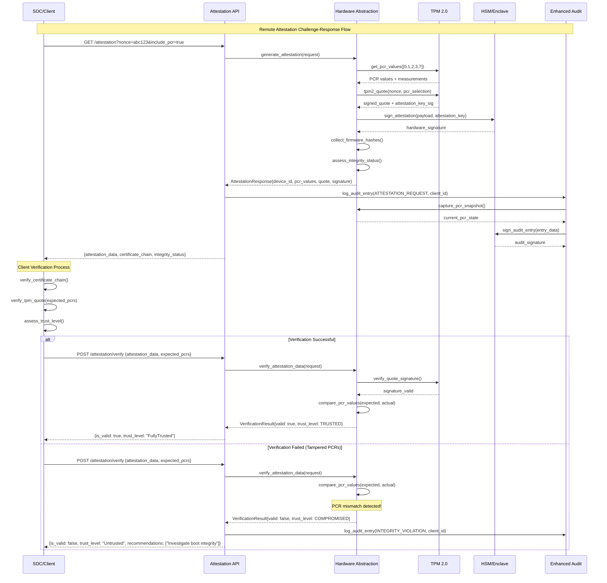
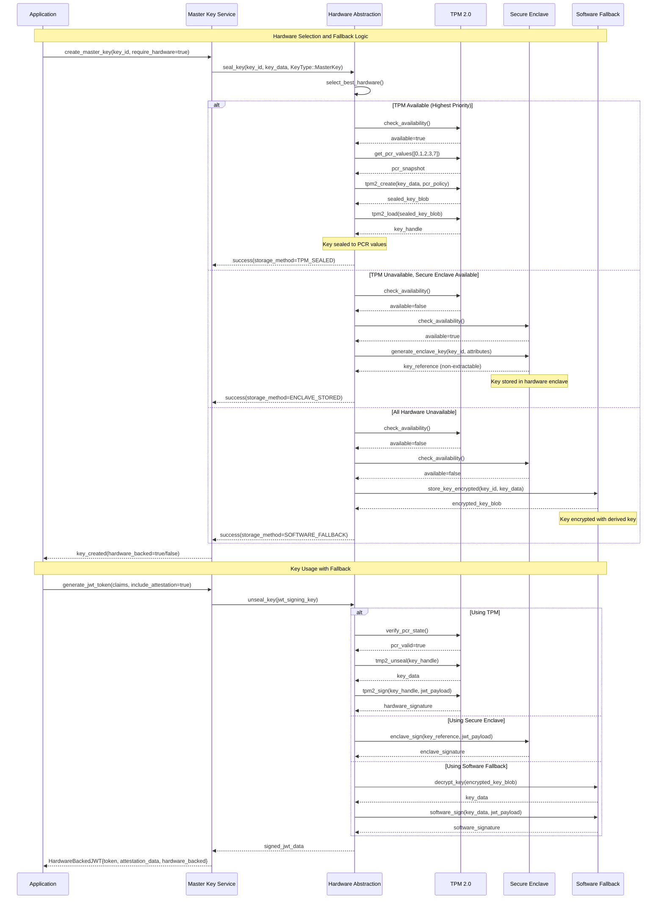
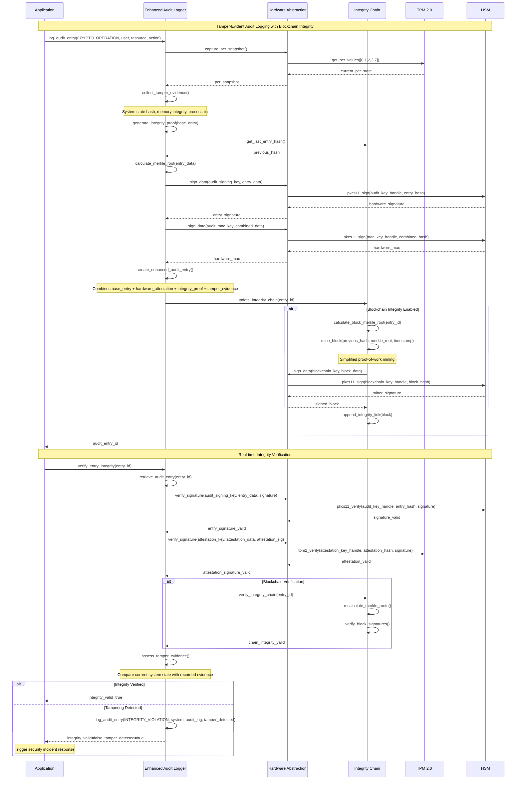
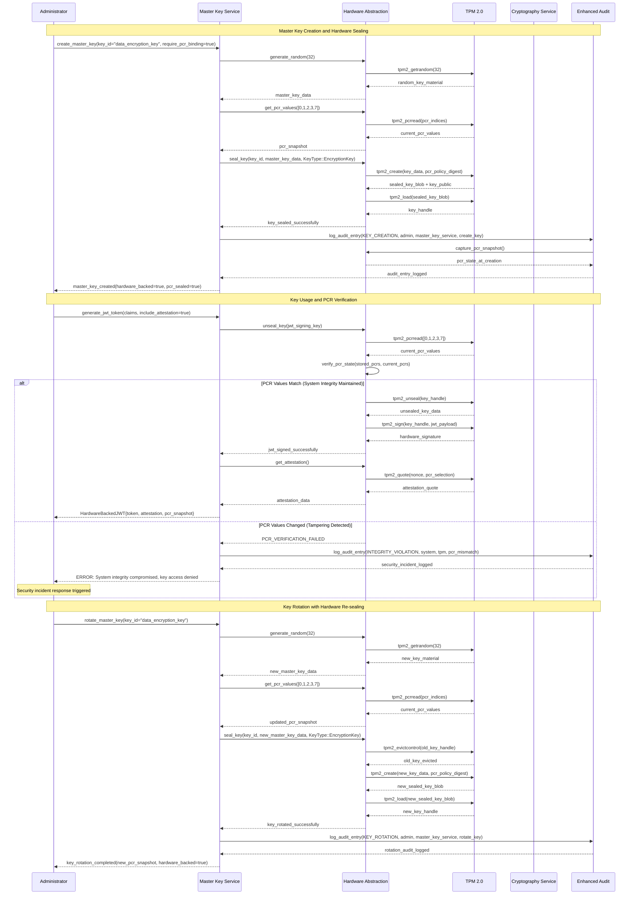
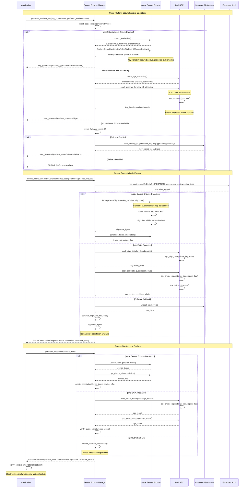

# Universal AI Governor - Sequence Diagrams

## Remote Attestation Flow

## Hardware Fallback Hierarchy

## Enhanced Audit Blockchain Flow

## Master Key Lifecycle with Hardware Sealing

## Secure Enclave Integration Flow

These sequence diagrams illustrate the complete hardware integration flows for our Universal AI Governor, showing how TPM, HSM, and Secure Enclave components work together to provide military-grade security with comprehensive audit trails and tamper detection.
